## Models
* [A Deep-Learning model](Train_Run_DL_Models.ipynb) based on the [Random Forest model](https://github.com/TRI-AMDD/trixs/blob/Torrisi_XANES_RF_2020/notebooks/Train_Run_Models.ipynb) from a published article: 
   * [Random forest machine learning models for interpretable X-ray absorption near-edge structure spectrum-property relationships](https://www.nature.com/articles/s41524-020-00376-6)
* Current version: DL vs RF on pointwise spectra data
  * NN model without regularization : [Train_Run_DL_Models.ipynb](Train_Run_DL_Models.ipynb)
  * NN model with regularization : [Train_Run_DL_Models_V2.ipynb](Train_Run_DL_Models.ipynb)
  * CNN model:
    * trained with original data : [Train_Run_DL_Models_CNN_originalData.ipynb](Train_Run_DL_Models_CNN_originalData.ipynb)
    * data augmentation (average pooling): [Train_Run_DL_Models_CNN_moreData.ipynb](Train_Run_DL_Models_CNN_moreData.ipynb)
* All scenarios:
  
| Status                   | Model      | Data      | Iteration/Epoch | Cross-Validation | Kernel-Size | Feature Importance | Notebook | Performance Bader | Performance MD | Performance All |
| ------------------------ | -----------| --------- | -------------   | ---------------- | ----------- | --  | -------- | -------- | -------- | -------- |
| :heavy_check_mark: | Random Forest    | original  | 300             | 3                | -           | Yes | [done](Train_Run_DL_Models_CNN_originalData.ipynb)| 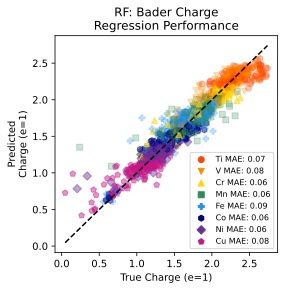 |  | 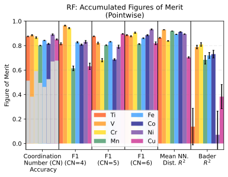 | 
| :heavy_check_mark: | Neural Networks  | original  | 300             | 3                | -           | Yes | [done](Train_Run_DL_Models.ipynb)| 
| :heavy_check_mark: | CNN              | original  | 300             | 3                | 5           | No | [done](Train_Run_DL_Models_CNN_originalData.ipynb)|  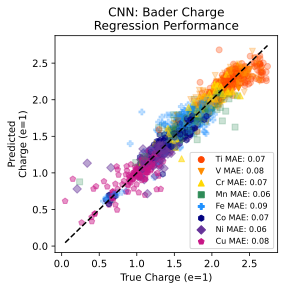 | 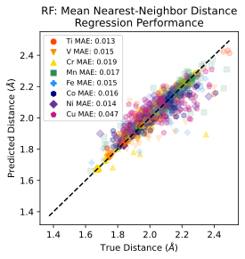 |  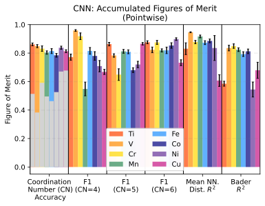 |  
| :heavy_check_mark: | CNN              | original  | 300             | 3                | 10          | No | [done](Train_Run_DL_Models_CNN_originalData_10.ipynb)| 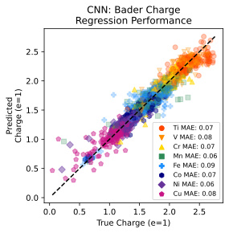 | 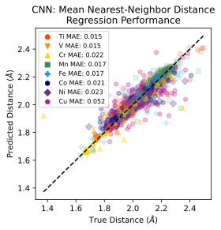 |   | 
| :heavy_check_mark: | CNN              | original  | 300             | 3                | 20          | No | [done](Train_Run_DL_Models_CNN_originalData_20.ipynb)|  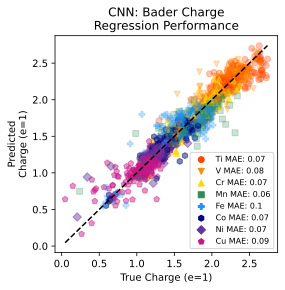 | 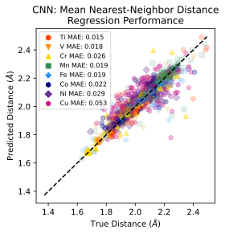 |  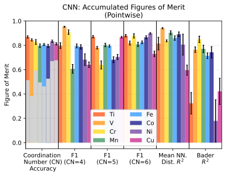 |  
| :heavy_check_mark: | Random Forest    | augmented | 300             | 3                | -           | Yes | [done](Train_Run_DL_Models_CNN_moreData.ipyn)|  |  |  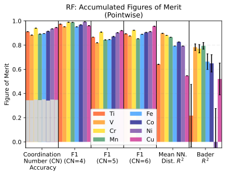 | 
| :heavy_check_mark: | Neural Networks  | augmented | 300             | 3                | -           | Yes | [done](Train_Run_DL_Models_moreData.ipynb)|
| :heavy_check_mark: | CNN              | augmented | 300             | 3                | 5           | No | [done](Train_Run_DL_Models_CNN_moreData_5.ipynb)|  |  | 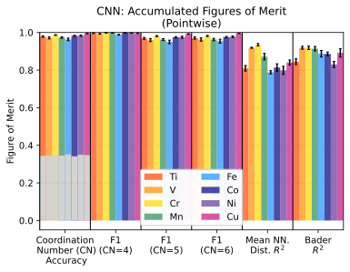 | 
| :heavy_check_mark: | CNN              | augmented | 300             | 3                | 10          | No | [done](Train_Run_DL_Models_CNN_moreData_10.ipynb)|  |  | 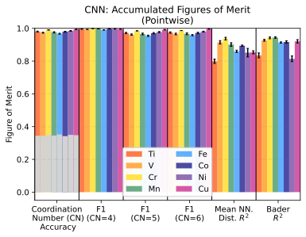 | 
| :heavy_check_mark: | CNN              | augmented | 300             | 3                | 20          | No | [done](Train_Run_DL_Models_CNN_moreData_20.ipynb)|  |  | 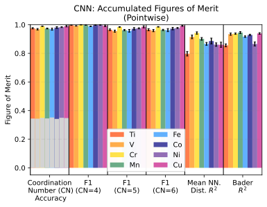 | 


## Data:
* training data: https://data.matr.io/4/

```
wget https://s3.amazonaws.com/publications.matr.io/4/deployment/data/xanes_2019.zip

unzip xanes_2019.zip

git clone https://github.com/fengchenLBL/trixs-dl-models.git

cp -rf matrio_folder/spectral_data matrio_folder/model_data ./trixs-dl-models

cd trixs-dl-models
```

## References:
* [https://www.nature.com/articles/s41524-020-00376-6](https://www.nature.com/articles/s41524-020-00376-6)
* [https://github.com/TRI-AMDD/trixs/blob/Torrisi_XANES_RF_2020/notebooks/Train_Run_Models.ipynb](https://github.com/TRI-AMDD/trixs/blob/Torrisi_XANES_RF_2020/notebooks/Train_Run_Models.ipynb)
* [https://data.matr.io/4/](https://data.matr.io/4/)
