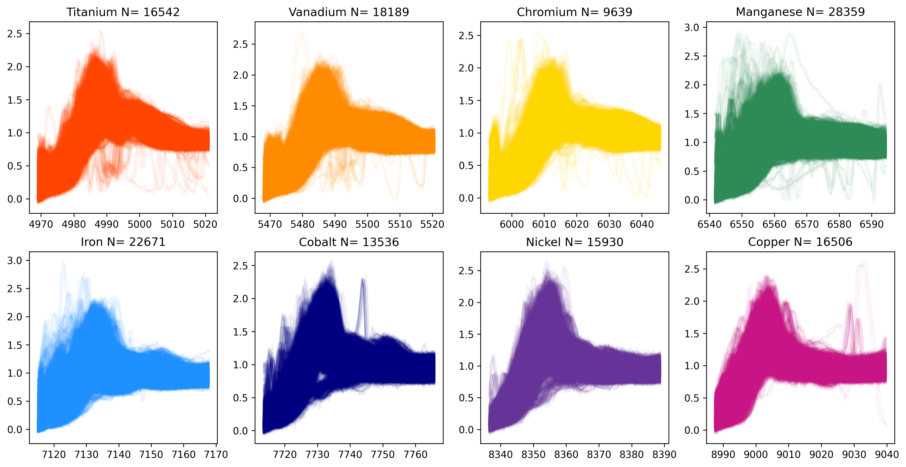
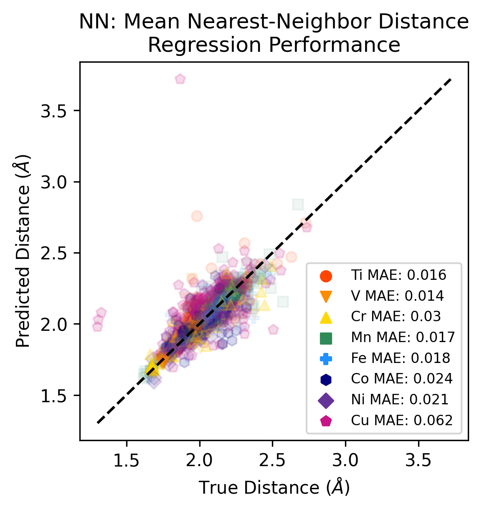
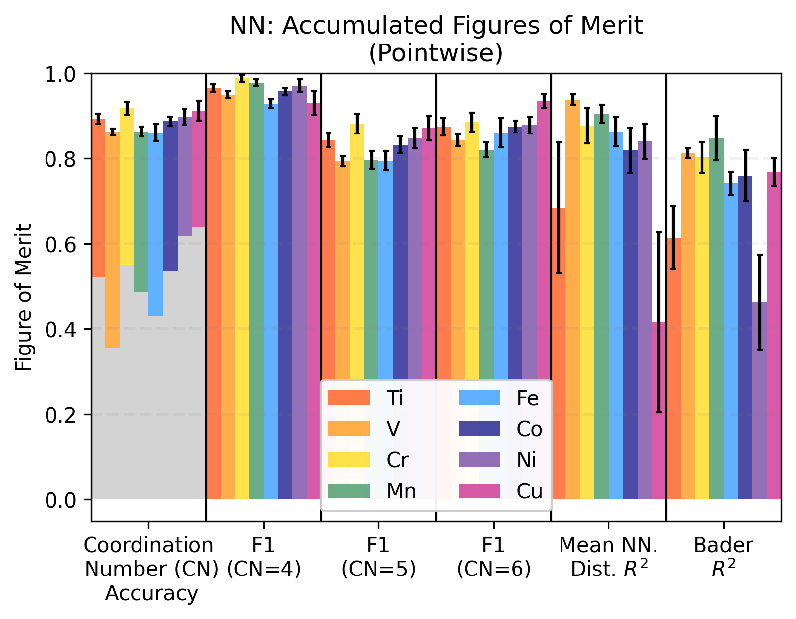
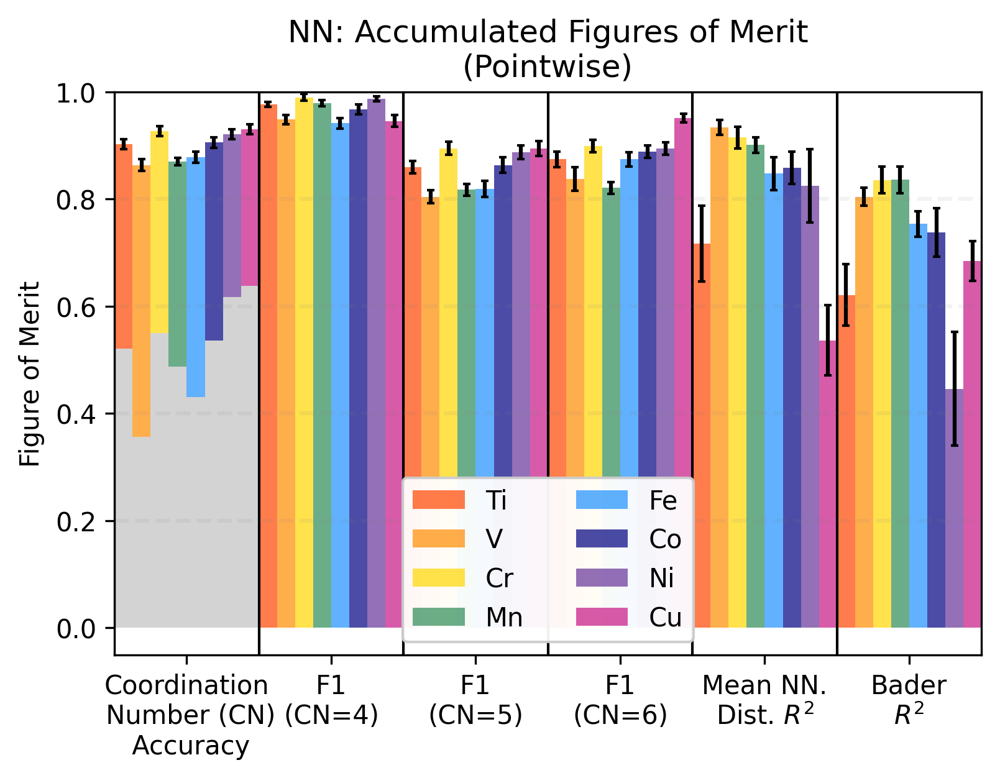

# trixs-dl-models
## Models
* [A Deep-Learning model](Train_Run_DL_Models.ipynb) based on the [Random Forest model](https://github.com/TRI-AMDD/trixs/blob/Torrisi_XANES_RF_2020/notebooks/Train_Run_Models.ipynb) from a published article: 
   * [Random forest machine learning models for interpretable X-ray absorption near-edge structure spectrum-property relationships](https://www.nature.com/articles/s41524-020-00376-6)
* Current version: DL vs RF on pointwise spectra data
  * NN model without regularization : [Train_Run_DL_Models.ipynb](Train_Run_DL_Models.ipynb)
  * NN model with regularization : [Train_Run_DL_Models_V2.ipynb](Train_Run_DL_Models.ipynb)
  * CNN model:
    * trained with original data : [Train_Run_DL_Models_CNN_originalData.ipynb](Train_Run_DL_Models_CNN_originalData.ipynb)
    * data augmentation (average pooling): [Train_Run_DL_Models_CNN_moreData.ipynb](Train_Run_DL_Models_CNN_moreData.ipynb)

* Data:

| Coordination | Bader      | Mean Distance |
| ------------ | -----------| ------------- |
|  |  |  |

* All scenarios:
  
| Status                   | Model      | Data      | Iteration/Epoch | Cross-Validation | Kernel-Size | Feature Importance | Notebook | Performance Bader | Performance MD | Performance All |
| ------------------------ | -----------| --------- | -------------   | ---------------- | ----------- | --  | -------- | -------- | -------- | -------- |
| :heavy_check_mark: | Random Forest    | original  | 300             | 10                | -           | Yes | [done](Train_Run_DL_Models_CNN_originalData.ipynb)|  |  |  | 
| :heavy_check_mark: | Neural Networks  | original  | 300             | 10                | -           | Yes | [done](Train_Run_DL_Models.ipynb)|  |  |  | 
| :heavy_check_mark: | CNN              | original  | 300             | 10                | 5           | No | [done](Train_Run_DL_Models_CNN_originalData.ipynb)|   |  |   |  
| :heavy_check_mark: | CNN              | original  | 300             | 10                | 10          | No | [done](Train_Run_DL_Models_CNN_originalData_10.ipynb)|  |  |   | 
| :heavy_check_mark: | CNN              | original  | 300             | 10                | 20          | No | [done](Train_Run_DL_Models_CNN_originalData_20.ipynb)|   |  |   |   
| :heavy_check_mark: | Random Forest  | augmented | 300             | 20                | -           | Yes | [done](Train_Run_DL_Models_moreData_P2.ipynb)|  |  |  | 
| :heavy_check_mark: | Neural Networks  | augmented | 300             | 20                | -           | Yes | [done](Train_Run_DL_Models_moreData_P2.ipynb)|  |  |  | 
| :heavy_check_mark: | CNN              | augmented | 300             | 20                | 5           | No | [done](Train_Run_DL_Models_CNN_moreData_5_P2.ipynb)|  |  |  | 
| :heavy_check_mark: | CNN              | augmented | 300             | 20                | 10          | No | [done](Train_Run_DL_Models_CNN_moreData_10_P2.ipynb)|  |  |  | 
| :heavy_check_mark: | CNN              | augmented | 300             | 20                | 20          | No | [done](Train_Run_DL_Models_CNN_moreData_20_P2.ipynb)|  |  |  |
| :heavy_check_mark: | Random Forest  | augmented* | 300             | 20                | -           | Yes | [done](Train_Run_DL_Models_moreData_P3.ipynb)|  |  |  | 
| :heavy_check_mark: | Neural Networks  | augmented* | 300             | 20                | -           | Yes | [done](Train_Run_DL_Models_moreData_P3.ipynb)|  |  |  | 
| :heavy_check_mark: | CNN              | augmented* | 300             | 20                | 5           | No | [done](Train_Run_DL_Models_CNN_moreData_5_P3.ipynb)|  |  |  | 
| :heavy_check_mark: | CNN              | augmented* | 300             | 20                | 10          | No | [done](Train_Run_DL_Models_CNN_moreData_10_P3.ipynb)|  |  |  | 
| :heavy_check_mark: | CNN              | augmented* | 300             | 20                | 20          | No | [done](Train_Run_DL_Models_CNN_moreData_20_P3.ipynb)|  |  |  |

## Results
### RF vs DL Augmentation Performance
|    |   Unnamed: 0 | NN-Material   |   NN- Coord Baseline | RF- Coord Acc.   | NN- Coord Acc.   | RF- Coord F1 (4)   | NN- Coord F1 (4)   | RF- Coord F1 (5)   | NN- Coord F1 (5)   | RF- Coord F1 (6)   | NN- Coord F1 (6)   | RF- Bader $R^2$   | NN- Bader $R^2$   | RF- Bader MAE    | NN- Bader MAE    | RF- Mean NN $R^2$   | NN- Mean NN $R^2$   | RF- Mean NN-MAE   | NN- Mean NN-MAE   |
|----|--------------|---------------|----------------------|------------------|------------------|--------------------|--------------------|--------------------|--------------------|--------------------|--------------------|-------------------|-------------------|------------------|------------------|---------------------|---------------------|-------------------|-------------------|
|  0 |            0 | Ti            |                34.43 | 88.20 $\pm$ 0.12 | 91.48 $\pm$ 0.58 | 93.84 $ \pm$ 0.13  | 97.27 $ \pm$ 0.50  | 81.98 $ \pm$ 0.20  | 87.64 $ \pm$ 0.85  | 88.67 $ \pm$ 0.17  | 89.78 $ \pm$ 0.75  | 64.08 $\pm$0.23   | 74.46 $\pm$1.18   | 0.060 $\pm$0.000 | 0.060 $\pm$0.002 | 80.77 $\pm$0.18     | 88.27 $\pm$1.15     | 0.015 $\pm$0.000  | 0.012 $\pm$0.001  |
|  1 |            1 | V             |                34.35 | 86.56 $\pm$ 0.15 | 89.11 $\pm$ 0.67 | 94.64 $ \pm$ 0.09  | 96.40 $ \pm$ 0.43  | 78.81 $ \pm$ 0.24  | 83.93 $ \pm$ 1.09  | 85.87 $ \pm$ 0.17  | 87.19 $ \pm$ 0.84  | 84.88 $\pm$0.05   | 88.13 $\pm$0.43   | 0.070 $\pm$0.000 | 0.060 $\pm$0.001 | 94.90 $\pm$0.03     | 96.71 $\pm$0.27     | 0.014 $\pm$0.000  | 0.012 $\pm$0.001  |
|  2 |            2 | Cr            |                34.93 | 90.76 $\pm$ 0.21 | 93.50 $\pm$ 1.13 | 97.64 $ \pm$ 0.10  | 99.08 $ \pm$ 0.39  | 85.29 $ \pm$ 0.35  | 90.12 $ \pm$ 1.73  | 89.29 $ \pm$ 0.27  | 91.39 $ \pm$ 1.39  | 87.27 $\pm$0.10   | 92.27 $\pm$0.37   | 0.060 $\pm$0.000 | 0.050 $\pm$0.001 | 92.10 $\pm$0.09     | 95.19 $\pm$0.75     | 0.020 $\pm$0.000  | 0.019 $\pm$0.003  |
|  3 |            3 | Mn            |                34.54 | 87.45 $\pm$ 0.09 | 89.40 $\pm$ 0.64 | 96.27 $ \pm$ 0.05  | 98.10 $ \pm$ 0.35  | 81.85 $ \pm$ 0.15  | 84.80 $ \pm$ 1.01  | 84.95 $ \pm$ 0.13  | 86.06 $ \pm$ 0.77  | 85.05 $\pm$0.07   | 90.66 $\pm$0.49   | 0.060 $\pm$0.000 | 0.050 $\pm$0.001 | 92.10 $\pm$0.05     | 93.86 $\pm$0.25     | 0.018 $\pm$0.000  | 0.016 $\pm$0.001  |
|  4 |            4 | Fe            |                35.2  | 86.42 $\pm$ 0.14 | 88.16 $\pm$ 0.71 | 91.82 $ \pm$ 0.12  | 93.61 $ \pm$ 0.56  | 79.99 $ \pm$ 0.21  | 82.66 $ \pm$ 1.25  | 87.57 $ \pm$ 0.14  | 88.36 $ \pm$ 0.66  | 78.32 $\pm$0.07   | 82.29 $\pm$0.38   | 0.100 $\pm$0.000 | 0.080 $\pm$0.001 | 86.44 $\pm$0.07     | 89.97 $\pm$1.09     | 0.017 $\pm$0.000  | 0.015 $\pm$0.001  |
|  5 |            5 | Co            |                34.19 | 88.75 $\pm$ 0.14 | 90.67 $\pm$ 1.22 | 93.91 $ \pm$ 0.12  | 96.04 $ \pm$ 1.14  | 82.50 $ \pm$ 0.23  | 86.13 $ \pm$ 1.76  | 89.60 $ \pm$ 0.18  | 90.02 $ \pm$ 0.86  | 80.89 $\pm$0.10   | 87.92 $\pm$0.50   | 0.070 $\pm$0.000 | 0.060 $\pm$0.001 | 89.87 $\pm$0.07     | 92.00 $\pm$0.65     | 0.018 $\pm$0.000  | 0.017 $\pm$0.001  |
|  6 |            6 | Ni            |                34.98 | 89.21 $\pm$ 0.13 | 91.49 $\pm$ 0.64 | 96.18 $ \pm$ 0.13  | 97.25 $ \pm$ 0.64  | 83.56 $ \pm$ 0.19  | 87.27 $ \pm$ 0.97  | 88.06 $ \pm$ 0.15  | 90.23 $ \pm$ 0.74  | 62.85 $\pm$0.31   | 77.65 $\pm$1.52   | 0.060 $\pm$0.000 | 0.050 $\pm$0.002 | 88.30 $\pm$0.10     | 91.30 $\pm$0.80     | 0.016 $\pm$0.000  | 0.015 $\pm$0.001  |
|  7 |            7 | Cu            |                34.78 | 88.89 $\pm$ 0.14 | 92.54 $\pm$ 1.62 | 90.90 $ \pm$ 0.17  | 94.31 $ \pm$ 1.44  | 84.98 $ \pm$ 0.18  | 89.45 $ \pm$ 2.07  | 91.25 $ \pm$ 0.12  | 94.00 $ \pm$ 1.38  | 75.65 $\pm$0.14   | 89.60 $\pm$0.62   | 0.080 $\pm$0.000 | 0.050 $\pm$0.002 | 61.36 $\pm$0.20     | 65.80 $\pm$2.35     | 0.053 $\pm$0.000  | 0.050 $\pm$0.003  |
|  8 |            8 | 'Avgs.'       |                34.67 | 88.28            | 90.79            | 94.4               | 96.51              | 82.37              | 86.5               | 88.16              | 89.63              | 77.37             | 85.37             | 0.07             | 0.06             | 85.73               | 89.14               | 0.02              | 0.02              |
### RF vs DL Augmentation P-Value
|    |   Unnamed: 0 | Material   |   P-Value Acc |   P-Value F4 |   P-Value F5 |   P-Value F6 |   P-Value B R2 |   P-Value B MAE |   P-Value MD R2 |   P-Value MD MAE |
|----|--------------|------------|---------------|--------------|--------------|--------------|----------------|-----------------|-----------------|------------------|
|  0 |            0 | Ti         |   1.90735e-06 |  1.90735e-06 |  1.90735e-06 |  8.2016e-05  |    1.90735e-06 |     1.90735e-06 |     1.90735e-06 |      1.90735e-06 |
|  1 |            1 | V          |   1.90735e-06 |  1.90735e-06 |  1.90735e-06 |  1.90735e-05 |    1.90735e-06 |     1.90735e-06 |     1.90735e-06 |      3.8147e-06  |
|  2 |            2 | Cr         |   9.53674e-06 |  1.90735e-06 |  3.8147e-06  |  6.29425e-05 |    1.90735e-06 |     1.90735e-06 |     1.90735e-06 |      0.105398    |
|  3 |            3 | Mn         |   1.90735e-06 |  1.90735e-06 |  1.90735e-06 |  4.76837e-05 |    1.90735e-06 |     1.90735e-06 |     1.90735e-06 |      1.90735e-06 |
|  4 |            4 | Fe         |   3.8147e-06  |  1.90735e-06 |  3.8147e-06  |  6.29425e-05 |    1.90735e-06 |     1.90735e-06 |     1.90735e-06 |      1.90735e-06 |
|  5 |            5 | Co         |   3.62396e-05 |  9.53674e-06 |  1.90735e-06 |  0.0399895   |    1.90735e-06 |     1.90735e-06 |     1.90735e-06 |      1.33514e-05 |
|  6 |            6 | Ni         |   1.90735e-06 |  0.000104904 |  1.90735e-06 |  1.90735e-06 |    1.90735e-06 |     1.90735e-06 |     1.90735e-06 |      0.0362339   |
|  7 |            7 | Cu         |   3.8147e-06  |  3.8147e-06  |  5.72205e-06 |  9.53674e-06 |    1.90735e-06 |     1.90735e-06 |     1.33514e-05 |      0.000585556 |
### RF vs CNN 20 Augmentation Performance
|    |   Unnamed: 0 | NN-Material   |   NN- Coord Baseline | RF- Coord Acc.   | NN- Coord Acc.   | RF- Coord F1 (4)   | NN- Coord F1 (4)   | RF- Coord F1 (5)   | NN- Coord F1 (5)   | RF- Coord F1 (6)   | NN- Coord F1 (6)   | RF- Bader $R^2$   | NN- Bader $R^2$   | RF- Bader MAE    | NN- Bader MAE    | RF- Mean NN $R^2$   | NN- Mean NN $R^2$   | RF- Mean NN-MAE   | NN- Mean NN-MAE   |
|----|--------------|---------------|----------------------|------------------|------------------|--------------------|--------------------|--------------------|--------------------|--------------------|--------------------|-------------------|-------------------|------------------|------------------|---------------------|---------------------|-------------------|-------------------|
|  0 |            0 | Ti            |                34.43 | 88.20 $\pm$ 0.12 | 91.76 $\pm$ 0.63 | 93.84 $ \pm$ 0.13  | 97.30 $ \pm$ 0.65  | 81.98 $ \pm$ 0.20  | 88.04 $ \pm$ 0.86  | 88.67 $ \pm$ 0.17  | 90.19 $ \pm$ 0.53  | 64.08 $\pm$0.23   | 74.40 $\pm$1.37   | 0.060 $\pm$0.000 | 0.060 $\pm$0.002 | 80.77 $\pm$0.18     | 88.40 $\pm$1.18     | 0.015 $\pm$0.000  | 0.012 $\pm$0.001  |
|  1 |            1 | V             |                34.35 | 86.56 $\pm$ 0.15 | 89.19 $\pm$ 0.60 | 94.64 $ \pm$ 0.09  | 96.57 $ \pm$ 0.29  | 78.81 $ \pm$ 0.24  | 84.18 $ \pm$ 0.83  | 85.87 $ \pm$ 0.17  | 87.06 $ \pm$ 0.92  | 84.88 $\pm$0.05   | 88.04 $\pm$0.59   | 0.070 $\pm$0.000 | 0.060 $\pm$0.002 | 94.90 $\pm$0.03     | 96.77 $\pm$0.20     | 0.014 $\pm$0.000  | 0.012 $\pm$0.000  |
|  2 |            2 | Cr            |                34.93 | 90.76 $\pm$ 0.21 | 93.63 $\pm$ 1.90 | 97.64 $ \pm$ 0.10  | 99.07 $ \pm$ 0.72  | 85.29 $ \pm$ 0.35  | 90.32 $ \pm$ 2.66  | 89.29 $ \pm$ 0.27  | 91.61 $ \pm$ 2.37  | 87.27 $\pm$0.10   | 92.34 $\pm$0.61   | 0.060 $\pm$0.000 | 0.050 $\pm$0.002 | 92.10 $\pm$0.09     | 95.27 $\pm$0.55     | 0.020 $\pm$0.000  | 0.018 $\pm$0.002  |
|  3 |            3 | Mn            |                34.54 | 87.45 $\pm$ 0.09 | 89.27 $\pm$ 0.61 | 96.27 $ \pm$ 0.05  | 98.04 $ \pm$ 0.38  | 81.85 $ \pm$ 0.15  | 84.69 $ \pm$ 0.66  | 84.95 $ \pm$ 0.13  | 85.86 $ \pm$ 0.97  | 85.05 $\pm$0.07   | 90.65 $\pm$0.41   | 0.060 $\pm$0.000 | 0.050 $\pm$0.001 | 92.10 $\pm$0.05     | 93.75 $\pm$0.43     | 0.018 $\pm$0.000  | 0.016 $\pm$0.001  |
|  4 |            4 | Fe            |                35.2  | 86.42 $\pm$ 0.14 | 88.62 $\pm$ 0.64 | 91.82 $ \pm$ 0.12  | 93.93 $ \pm$ 0.44  | 79.99 $ \pm$ 0.21  | 83.69 $ \pm$ 0.83  | 87.57 $ \pm$ 0.14  | 88.49 $ \pm$ 0.94  | 78.32 $\pm$0.07   | 82.06 $\pm$1.90   | 0.100 $\pm$0.000 | 0.080 $\pm$0.003 | 86.44 $\pm$0.07     | 90.39 $\pm$0.63     | 0.017 $\pm$0.000  | 0.015 $\pm$0.001  |
|  5 |            5 | Co            |                34.19 | 88.75 $\pm$ 0.14 | 90.53 $\pm$ 0.86 | 93.91 $ \pm$ 0.12  | 96.09 $ \pm$ 0.99  | 82.50 $ \pm$ 0.23  | 86.05 $ \pm$ 1.11  | 89.60 $ \pm$ 0.18  | 89.69 $ \pm$ 0.96  | 80.89 $\pm$0.10   | 87.61 $\pm$0.65   | 0.070 $\pm$0.000 | 0.060 $\pm$0.002 | 89.87 $\pm$0.07     | 91.87 $\pm$0.71     | 0.018 $\pm$0.000  | 0.017 $\pm$0.002  |
|  6 |            6 | Ni            |                34.98 | 89.21 $\pm$ 0.13 | 91.30 $\pm$ 0.76 | 96.18 $ \pm$ 0.13  | 97.21 $ \pm$ 0.63  | 83.56 $ \pm$ 0.19  | 86.94 $ \pm$ 1.19  | 88.06 $ \pm$ 0.15  | 90.02 $ \pm$ 0.70  | 62.85 $\pm$0.31   | 77.69 $\pm$2.12   | 0.060 $\pm$0.000 | 0.050 $\pm$0.001 | 88.30 $\pm$0.10     | 91.35 $\pm$1.20     | 0.016 $\pm$0.000  | 0.015 $\pm$0.002  |
|  7 |            7 | Cu            |                34.78 | 88.89 $\pm$ 0.14 | 92.75 $\pm$ 0.88 | 90.90 $ \pm$ 0.17  | 94.47 $ \pm$ 0.70  | 84.98 $ \pm$ 0.18  | 89.68 $ \pm$ 1.21  | 91.25 $ \pm$ 0.12  | 94.21 $ \pm$ 0.83  | 75.65 $\pm$0.14   | 89.83 $\pm$0.46   | 0.080 $\pm$0.000 | 0.050 $\pm$0.001 | 61.36 $\pm$0.20     | 67.00 $\pm$1.55     | 0.053 $\pm$0.000  | 0.049 $\pm$0.003  |
|  8 |            8 | 'Avgs.'       |                34.67 | 88.28            | 90.88            | 94.4               | 96.58              | 82.37              | 86.7               | 88.16              | 89.64              | 77.37             | 85.33             | 0.07             | 0.06             | 85.73               | 89.35               | 0.02              | 0.02              |
### RF vs CNN 20 Augmentation P-Value
|    |   Unnamed: 0 | Material   |   P-Value Acc |   P-Value F4 |   P-Value F5 |   P-Value F6 |   P-Value B R2 |   P-Value B MAE |   P-Value MD R2 |   P-Value MD MAE |
|----|--------------|------------|---------------|--------------|--------------|--------------|----------------|-----------------|-----------------|------------------|
|  0 |            0 | Ti         |   1.90735e-06 |  1.90735e-06 |  1.90735e-06 |  1.90735e-06 |    1.90735e-06 |     1.90735e-06 |     1.90735e-06 |      1.90735e-06 |
|  1 |            1 | V          |   1.90735e-06 |  1.90735e-06 |  1.90735e-06 |  0.000133514 |    1.90735e-06 |     1.90735e-06 |     1.90735e-06 |      1.90735e-06 |
|  2 |            2 | Cr         |   0.000707626 |  9.53674e-06 |  2.67029e-05 |  0.000850677 |    1.90735e-06 |     1.90735e-06 |     1.90735e-06 |      0.000585556 |
|  3 |            3 | Mn         |   1.90735e-06 |  1.90735e-06 |  1.90735e-06 |  0.000850677 |    1.90735e-06 |     1.90735e-06 |     1.90735e-06 |      1.90735e-05 |
|  4 |            4 | Fe         |   1.90735e-06 |  1.90735e-06 |  1.90735e-06 |  0.00120926  |    0.000322342 |     1.90735e-06 |     1.90735e-06 |      1.33514e-05 |
|  5 |            5 | Co         |   3.8147e-06  |  5.72205e-06 |  1.90735e-06 |  0.756166    |    1.90735e-06 |     1.90735e-06 |     3.8147e-06  |      0.00271225  |
|  6 |            6 | Ni         |   1.90735e-06 |  1.90735e-05 |  1.90735e-06 |  1.90735e-06 |    1.90735e-06 |     1.90735e-06 |     1.90735e-06 |      0.0266418   |
|  7 |            7 | Cu         |   1.90735e-06 |  1.90735e-06 |  1.90735e-06 |  1.90735e-06 |    1.90735e-06 |     1.90735e-06 |     1.90735e-06 |      9.53674e-06 |
### RF vs CNN 10 Augmentation Performance
|    |   Unnamed: 0 | NN-Material   |   NN- Coord Baseline | RF- Coord Acc.   | NN- Coord Acc.   | RF- Coord F1 (4)   | NN- Coord F1 (4)   | RF- Coord F1 (5)   | NN- Coord F1 (5)   | RF- Coord F1 (6)   | NN- Coord F1 (6)   | RF- Bader $R^2$   | NN- Bader $R^2$   | RF- Bader MAE    | NN- Bader MAE    | RF- Mean NN $R^2$   | NN- Mean NN $R^2$   | RF- Mean NN-MAE   | NN- Mean NN-MAE   |
|----|--------------|---------------|----------------------|------------------|------------------|--------------------|--------------------|--------------------|--------------------|--------------------|--------------------|-------------------|-------------------|------------------|------------------|---------------------|---------------------|-------------------|-------------------|
|  0 |            0 | Ti            |                34.43 | 88.20 $\pm$ 0.12 | 91.63 $\pm$ 0.61 | 93.84 $ \pm$ 0.13  | 97.44 $ \pm$ 0.41  | 81.98 $ \pm$ 0.20  | 87.73 $ \pm$ 0.92  | 88.67 $ \pm$ 0.17  | 89.94 $ \pm$ 0.79  | 64.08 $\pm$0.23   | 74.60 $\pm$1.15   | 0.060 $\pm$0.000 | 0.060 $\pm$0.002 | 80.77 $\pm$0.18     | 88.84 $\pm$1.22     | 0.015 $\pm$0.000  | 0.012 $\pm$0.001  |
|  1 |            1 | V             |                34.35 | 86.56 $\pm$ 0.15 | 89.16 $\pm$ 0.62 | 94.64 $ \pm$ 0.09  | 96.53 $ \pm$ 0.42  | 78.81 $ \pm$ 0.24  | 84.07 $ \pm$ 1.02  | 85.87 $ \pm$ 0.17  | 87.10 $ \pm$ 0.69  | 84.88 $\pm$0.05   | 88.17 $\pm$0.52   | 0.070 $\pm$0.000 | 0.060 $\pm$0.001 | 94.90 $\pm$0.03     | 96.71 $\pm$0.24     | 0.014 $\pm$0.000  | 0.012 $\pm$0.001  |
|  2 |            2 | Cr            |                34.93 | 90.76 $\pm$ 0.21 | 93.91 $\pm$ 0.96 | 97.64 $ \pm$ 0.10  | 99.18 $ \pm$ 0.32  | 85.29 $ \pm$ 0.35  | 90.70 $ \pm$ 1.48  | 89.29 $ \pm$ 0.27  | 91.94 $ \pm$ 1.22  | 87.27 $\pm$0.10   | 92.11 $\pm$0.40   | 0.060 $\pm$0.000 | 0.050 $\pm$0.001 | 92.10 $\pm$0.09     | 95.31 $\pm$0.59     | 0.020 $\pm$0.000  | 0.018 $\pm$0.002  |
|  3 |            3 | Mn            |                34.54 | 87.45 $\pm$ 0.09 | 89.68 $\pm$ 0.43 | 96.27 $ \pm$ 0.05  | 98.15 $ \pm$ 0.38  | 81.85 $ \pm$ 0.15  | 85.13 $ \pm$ 0.63  | 84.95 $ \pm$ 0.13  | 86.50 $ \pm$ 0.53  | 85.05 $\pm$0.07   | 90.68 $\pm$0.31   | 0.060 $\pm$0.000 | 0.050 $\pm$0.001 | 92.10 $\pm$0.05     | 93.86 $\pm$0.32     | 0.018 $\pm$0.000  | 0.016 $\pm$0.001  |
|  4 |            4 | Fe            |                35.2  | 86.42 $\pm$ 0.14 | 88.37 $\pm$ 0.53 | 91.82 $ \pm$ 0.12  | 93.89 $ \pm$ 0.48  | 79.99 $ \pm$ 0.21  | 83.19 $ \pm$ 1.01  | 87.57 $ \pm$ 0.14  | 88.26 $ \pm$ 0.48  | 78.32 $\pm$0.07   | 82.31 $\pm$0.44   | 0.100 $\pm$0.000 | 0.080 $\pm$0.001 | 86.44 $\pm$0.07     | 90.31 $\pm$0.70     | 0.017 $\pm$0.000  | 0.015 $\pm$0.001  |
|  5 |            5 | Co            |                34.19 | 88.75 $\pm$ 0.14 | 90.95 $\pm$ 0.78 | 93.91 $ \pm$ 0.12  | 96.34 $ \pm$ 0.54  | 82.50 $ \pm$ 0.23  | 86.53 $ \pm$ 1.30  | 89.60 $ \pm$ 0.18  | 90.16 $ \pm$ 0.66  | 80.89 $\pm$0.10   | 87.99 $\pm$0.24   | 0.070 $\pm$0.000 | 0.050 $\pm$0.001 | 89.87 $\pm$0.07     | 91.84 $\pm$0.63     | 0.018 $\pm$0.000  | 0.017 $\pm$0.001  |
|  6 |            6 | Ni            |                34.98 | 89.21 $\pm$ 0.13 | 91.53 $\pm$ 0.74 | 96.18 $ \pm$ 0.13  | 97.25 $ \pm$ 0.41  | 83.56 $ \pm$ 0.19  | 87.41 $ \pm$ 1.06  | 88.06 $ \pm$ 0.15  | 90.22 $ \pm$ 1.03  | 62.85 $\pm$0.31   | 77.76 $\pm$1.59   | 0.060 $\pm$0.000 | 0.050 $\pm$0.002 | 88.30 $\pm$0.10     | 91.22 $\pm$0.80     | 0.016 $\pm$0.000  | 0.015 $\pm$0.001  |
|  7 |            7 | Cu            |                34.78 | 88.89 $\pm$ 0.14 | 92.78 $\pm$ 0.88 | 90.90 $ \pm$ 0.17  | 94.51 $ \pm$ 1.12  | 84.98 $ \pm$ 0.18  | 89.84 $ \pm$ 1.13  | 91.25 $ \pm$ 0.12  | 94.12 $ \pm$ 0.62  | 75.65 $\pm$0.14   | 89.81 $\pm$0.45   | 0.080 $\pm$0.000 | 0.050 $\pm$0.001 | 61.36 $\pm$0.20     | 63.89 $\pm$14.74    | 0.053 $\pm$0.000  | 0.051 $\pm$0.013  |
|  8 |            8 | 'Avgs.'       |                34.67 | 88.28            | 91.0             | 94.4               | 96.66              | 82.37              | 86.82              | 88.16              | 89.78              | 77.37             | 85.43             | 0.07             | 0.06             | 85.73               | 89.0                | 0.02              | 0.02              |
### RF vs CNN 10 Augmentation P-Value
|    |   Unnamed: 0 | Material   |   P-Value Acc |   P-Value F4 |   P-Value F5 |   P-Value F6 |   P-Value B R2 |   P-Value B MAE |   P-Value MD R2 |   P-Value MD MAE |
|----|--------------|------------|---------------|--------------|--------------|--------------|----------------|-----------------|-----------------|------------------|
|  0 |            0 | Ti         |   1.90735e-06 |  1.90735e-06 |  1.90735e-06 |  6.29425e-05 |    1.90735e-06 |     1.90735e-06 |     1.90735e-06 |      1.90735e-06 |
|  1 |            1 | V          |   1.90735e-06 |  1.90735e-06 |  1.90735e-06 |  1.90735e-06 |    1.90735e-06 |     1.90735e-06 |     1.90735e-06 |      1.90735e-06 |
|  2 |            2 | Cr         |   1.90735e-06 |  1.90735e-06 |  1.90735e-06 |  5.72205e-06 |    1.90735e-06 |     1.90735e-06 |     1.90735e-06 |      0.00198555  |
|  3 |            3 | Mn         |   1.90735e-06 |  1.90735e-06 |  1.90735e-06 |  1.90735e-06 |    1.90735e-06 |     1.90735e-06 |     1.90735e-06 |      1.90735e-06 |
|  4 |            4 | Fe         |   1.90735e-06 |  1.90735e-06 |  1.90735e-06 |  5.72205e-06 |    1.90735e-06 |     1.90735e-06 |     1.90735e-06 |      1.90735e-06 |
|  5 |            5 | Co         |   3.8147e-06  |  1.90735e-06 |  3.8147e-06  |  0.00485992  |    1.90735e-06 |     1.90735e-06 |     1.90735e-06 |      0.00271225  |
|  6 |            6 | Ni         |   1.90735e-06 |  1.90735e-06 |  1.90735e-06 |  1.90735e-06 |    1.90735e-06 |     1.90735e-06 |     1.90735e-06 |      0.000850677 |
|  7 |            7 | Cu         |   1.90735e-06 |  1.90735e-06 |  1.90735e-06 |  1.90735e-06 |    1.90735e-06 |     1.90735e-06 |     0.000707626 |      0.000850677 |
### RF vs CNN 5 Augmentation Performance
|    |   Unnamed: 0 | NN-Material   |   NN- Coord Baseline | RF- Coord Acc.   | NN- Coord Acc.   | RF- Coord F1 (4)   | NN- Coord F1 (4)   | RF- Coord F1 (5)   | NN- Coord F1 (5)   | RF- Coord F1 (6)   | NN- Coord F1 (6)   | RF- Bader $R^2$   | NN- Bader $R^2$   | RF- Bader MAE    | NN- Bader MAE    | RF- Mean NN $R^2$   | NN- Mean NN $R^2$   | RF- Mean NN-MAE   | NN- Mean NN-MAE   |
|----|--------------|---------------|----------------------|------------------|------------------|--------------------|--------------------|--------------------|--------------------|--------------------|--------------------|-------------------|-------------------|------------------|------------------|---------------------|---------------------|-------------------|-------------------|
|  0 |            0 | Ti            |                34.43 | 88.20 $\pm$ 0.12 | 91.31 $\pm$ 0.69 | 93.84 $ \pm$ 0.13  | 97.18 $ \pm$ 0.51  | 81.98 $ \pm$ 0.20  | 87.45 $ \pm$ 1.06  | 88.67 $ \pm$ 0.17  | 89.54 $ \pm$ 0.90  | 64.08 $\pm$0.23   | 74.37 $\pm$1.31   | 0.060 $\pm$0.000 | 0.060 $\pm$0.002 | 80.77 $\pm$0.18     | 88.53 $\pm$1.00     | 0.015 $\pm$0.000  | 0.012 $\pm$0.001  |
|  1 |            1 | V             |                34.35 | 86.56 $\pm$ 0.15 | 89.22 $\pm$ 0.59 | 94.64 $ \pm$ 0.09  | 96.50 $ \pm$ 0.39  | 78.81 $ \pm$ 0.24  | 83.98 $ \pm$ 1.05  | 85.87 $ \pm$ 0.17  | 87.34 $ \pm$ 0.70  | 84.88 $\pm$0.05   | 88.06 $\pm$0.20   | 0.070 $\pm$0.000 | 0.060 $\pm$0.001 | 94.90 $\pm$0.03     | 96.74 $\pm$0.24     | 0.014 $\pm$0.000  | 0.012 $\pm$0.000  |
|  2 |            2 | Cr            |                34.93 | 90.76 $\pm$ 0.21 | 93.89 $\pm$ 0.85 | 97.64 $ \pm$ 0.10  | 99.09 $ \pm$ 0.38  | 85.29 $ \pm$ 0.35  | 90.65 $ \pm$ 1.21  | 89.29 $ \pm$ 0.27  | 92.02 $ \pm$ 1.05  | 87.27 $\pm$0.10   | 92.12 $\pm$0.73   | 0.060 $\pm$0.000 | 0.050 $\pm$0.003 | 92.10 $\pm$0.09     | 95.39 $\pm$0.51     | 0.020 $\pm$0.000  | 0.018 $\pm$0.002  |
|  3 |            3 | Mn            |                34.54 | 87.45 $\pm$ 0.09 | 89.58 $\pm$ 0.47 | 96.27 $ \pm$ 0.05  | 98.13 $ \pm$ 0.24  | 81.85 $ \pm$ 0.15  | 85.01 $ \pm$ 0.70  | 84.95 $ \pm$ 0.13  | 86.36 $ \pm$ 0.69  | 85.05 $\pm$0.07   | 90.70 $\pm$0.35   | 0.060 $\pm$0.000 | 0.050 $\pm$0.001 | 92.10 $\pm$0.05     | 93.83 $\pm$0.25     | 0.018 $\pm$0.000  | 0.016 $\pm$0.000  |
|  4 |            4 | Fe            |                35.2  | 86.42 $\pm$ 0.14 | 88.16 $\pm$ 0.71 | 91.82 $ \pm$ 0.12  | 93.57 $ \pm$ 0.78  | 79.99 $ \pm$ 0.21  | 82.89 $ \pm$ 1.18  | 87.57 $ \pm$ 0.14  | 88.25 $ \pm$ 0.59  | 78.32 $\pm$0.07   | 82.30 $\pm$0.64   | 0.100 $\pm$0.000 | 0.080 $\pm$0.002 | 86.44 $\pm$0.07     | 90.35 $\pm$0.50     | 0.017 $\pm$0.000  | 0.015 $\pm$0.000  |
|  5 |            5 | Co            |                34.19 | 88.75 $\pm$ 0.14 | 91.09 $\pm$ 0.55 | 93.91 $ \pm$ 0.12  | 96.33 $ \pm$ 0.51  | 82.50 $ \pm$ 0.23  | 86.70 $ \pm$ 0.88  | 89.60 $ \pm$ 0.18  | 90.39 $ \pm$ 0.63  | 80.89 $\pm$0.10   | 87.90 $\pm$0.68   | 0.070 $\pm$0.000 | 0.060 $\pm$0.002 | 89.87 $\pm$0.07     | 92.15 $\pm$0.41     | 0.018 $\pm$0.000  | 0.017 $\pm$0.001  |
|  6 |            6 | Ni            |                34.98 | 89.21 $\pm$ 0.13 | 91.60 $\pm$ 0.71 | 96.18 $ \pm$ 0.13  | 97.36 $ \pm$ 0.48  | 83.56 $ \pm$ 0.19  | 87.44 $ \pm$ 1.01  | 88.06 $ \pm$ 0.15  | 90.27 $ \pm$ 0.83  | 62.85 $\pm$0.31   | 76.97 $\pm$2.80   | 0.060 $\pm$0.000 | 0.050 $\pm$0.003 | 88.30 $\pm$0.10     | 91.34 $\pm$0.85     | 0.016 $\pm$0.000  | 0.015 $\pm$0.002  |
|  7 |            7 | Cu            |                34.78 | 88.89 $\pm$ 0.14 | 92.99 $\pm$ 0.78 | 90.90 $ \pm$ 0.17  | 94.57 $ \pm$ 0.86  | 84.98 $ \pm$ 0.18  | 89.99 $ \pm$ 1.10  | 91.25 $ \pm$ 0.12  | 94.51 $ \pm$ 0.52  | 75.65 $\pm$0.14   | 89.59 $\pm$0.53   | 0.080 $\pm$0.000 | 0.050 $\pm$0.002 | 61.36 $\pm$0.20     | 66.71 $\pm$1.70     | 0.053 $\pm$0.000  | 0.049 $\pm$0.002  |
|  8 |            8 | 'Avgs.'       |                34.67 | 88.28            | 90.98            | 94.4               | 96.59              | 82.37              | 86.76              | 88.16              | 89.84              | 77.37             | 85.25             | 0.07             | 0.06             | 85.73               | 89.38               | 0.02              | 0.02              |
### RF vs CNN 5 Augmentation P-Value
|    |   Unnamed: 0 | Material   |   P-Value Acc |   P-Value F4 |   P-Value F5 |   P-Value F6 |   P-Value B R2 |   P-Value B MAE |   P-Value MD R2 |   P-Value MD MAE |
|----|--------------|------------|---------------|--------------|--------------|--------------|----------------|-----------------|-----------------|------------------|
|  0 |            0 | Ti         |   1.90735e-06 |  1.90735e-06 |  1.90735e-06 |  0.000585556 |    1.90735e-06 |     1.90735e-06 |     1.90735e-06 |      1.90735e-06 |
|  1 |            1 | V          |   1.90735e-06 |  1.90735e-06 |  1.90735e-06 |  5.72205e-06 |    1.90735e-06 |     1.90735e-06 |     1.90735e-06 |      1.90735e-06 |
|  2 |            2 | Cr         |   1.90735e-06 |  1.90735e-06 |  1.90735e-06 |  1.90735e-06 |    1.90735e-06 |     1.90735e-06 |     1.90735e-06 |      0.000167847 |
|  3 |            3 | Mn         |   1.90735e-06 |  1.90735e-06 |  1.90735e-06 |  1.90735e-06 |    1.90735e-06 |     1.90735e-06 |     1.90735e-06 |      1.90735e-06 |
|  4 |            4 | Fe         |   1.90735e-06 |  1.90735e-06 |  1.90735e-06 |  0.000394821 |    1.90735e-06 |     1.90735e-06 |     1.90735e-06 |      1.90735e-06 |
|  5 |            5 | Co         |   1.90735e-06 |  1.90735e-06 |  1.90735e-06 |  0.000167847 |    1.90735e-06 |     1.90735e-06 |     1.90735e-06 |      1.33514e-05 |
|  6 |            6 | Ni         |   1.90735e-06 |  1.90735e-06 |  1.90735e-06 |  1.90735e-06 |    1.90735e-06 |     1.90735e-06 |     1.90735e-06 |      0.00168991  |
|  7 |            7 | Cu         |   1.90735e-06 |  1.90735e-06 |  1.90735e-06 |  1.90735e-06 |    1.90735e-06 |     1.90735e-06 |     1.90735e-06 |      3.8147e-06  |
### RF vs DL Augmentation2 Performance
|    |   Unnamed: 0 | NN-Material   |   NN- Coord Baseline | RF- Coord Acc.   | NN- Coord Acc.   | RF- Coord F1 (4)   | NN- Coord F1 (4)   | RF- Coord F1 (5)   | NN- Coord F1 (5)   | RF- Coord F1 (6)   | NN- Coord F1 (6)   | RF- Bader $R^2$   | NN- Bader $R^2$   | RF- Bader MAE    | NN- Bader MAE    | RF- Mean NN $R^2$   | NN- Mean NN $R^2$   | RF- Mean NN-MAE   | NN- Mean NN-MAE   |
|----|--------------|---------------|----------------------|------------------|------------------|--------------------|--------------------|--------------------|--------------------|--------------------|--------------------|-------------------|-------------------|------------------|------------------|---------------------|---------------------|-------------------|-------------------|
|  0 |            0 | Ti            |                52.12 | 81.38 $\pm$ 0.20 | 82.11 $\pm$ 1.08 | 72.19 $ \pm$ 0.62  | 76.15 $ \pm$ 2.75  | 80.76 $ \pm$ 0.24  | 82.43 $ \pm$ 1.27  | 83.90 $ \pm$ 0.26  | 82.82 $ \pm$ 1.02  | 53.95 $\pm$0.68   | 65.82 $\pm$3.34   | 0.070 $\pm$0.000 | 0.060 $\pm$0.003 | 80.92 $\pm$0.35     | 84.32 $\pm$2.54     | 0.015 $\pm$0.000  | 0.013 $\pm$0.001  |
|  1 |            1 | V             |                35.6  | 82.41 $\pm$ 0.21 | 82.21 $\pm$ 0.88 | 91.31 $ \pm$ 0.21  | 90.84 $ \pm$ 0.81  | 73.70 $ \pm$ 0.36  | 75.16 $ \pm$ 1.39  | 82.85 $ \pm$ 0.22  | 82.02 $ \pm$ 1.32  | 82.97 $\pm$0.08   | 81.87 $\pm$1.10   | 0.070 $\pm$0.000 | 0.080 $\pm$0.002 | 92.22 $\pm$0.07     | 92.95 $\pm$0.76     | 0.015 $\pm$0.000  | 0.014 $\pm$0.000  |
|  2 |            2 | Cr            |                54.98 | 88.48 $\pm$ 0.44 | 87.42 $\pm$ 1.39 | 96.92 $ \pm$ 0.42  | 96.72 $ \pm$ 1.22  | 77.55 $ \pm$ 0.89  | 75.93 $ \pm$ 2.80  | 90.41 $ \pm$ 0.35  | 89.41 $ \pm$ 1.09  | 89.35 $\pm$0.14   | 90.68 $\pm$0.84   | 0.070 $\pm$0.000 | 0.060 $\pm$0.002 | 89.61 $\pm$0.31     | 89.65 $\pm$1.16     | 0.022 $\pm$0.000  | 0.022 $\pm$0.001  |
|  3 |            3 | Mn            |                48.79 | 81.66 $\pm$ 0.28 | 81.13 $\pm$ 0.79 | 65.55 $ \pm$ 0.73  | 70.73 $ \pm$ 3.03  | 80.70 $ \pm$ 0.29  | 80.47 $ \pm$ 0.90  | 84.22 $ \pm$ 0.30  | 82.61 $ \pm$ 0.79  | 87.29 $\pm$0.12   | 88.39 $\pm$0.82   | 0.060 $\pm$0.000 | 0.050 $\pm$0.002 | 90.12 $\pm$0.10     | 91.94 $\pm$0.59     | 0.018 $\pm$0.000  | 0.017 $\pm$0.001  |
|  4 |            4 | Fe            |                43.09 | 83.90 $\pm$ 0.28 | 82.60 $\pm$ 0.88 | 86.07 $ \pm$ 0.59  | 84.57 $ \pm$ 1.52  | 80.79 $ \pm$ 0.36  | 79.75 $ \pm$ 1.21  | 86.13 $ \pm$ 0.27  | 84.74 $ \pm$ 0.90  | 74.41 $\pm$0.20   | 72.67 $\pm$1.52   | 0.100 $\pm$0.000 | 0.100 $\pm$0.002 | 85.90 $\pm$0.09     | 88.06 $\pm$0.85     | 0.018 $\pm$0.000  | 0.017 $\pm$0.001  |
|  5 |            5 | Co            |                53.55 | 80.94 $\pm$ 0.45 | 80.00 $\pm$ 1.57 | 80.37 $ \pm$ 0.41  | 82.47 $ \pm$ 2.05  | 64.97 $ \pm$ 0.91  | 65.20 $ \pm$ 3.09  | 89.14 $ \pm$ 0.34  | 87.03 $ \pm$ 1.27  | 78.97 $\pm$0.33   | 80.88 $\pm$1.01   | 0.080 $\pm$0.001 | 0.070 $\pm$0.002 | 84.72 $\pm$0.13     | 82.96 $\pm$1.58     | 0.021 $\pm$0.000  | 0.020 $\pm$0.001  |
|  6 |            6 | Ni            |                61.72 | 81.29 $\pm$ 0.42 | 80.76 $\pm$ 1.17 | 61.03 $ \pm$ 1.11  | 57.75 $ \pm$ 3.06  | 70.06 $ \pm$ 0.79  | 70.13 $ \pm$ 2.06  | 89.46 $ \pm$ 0.23  | 88.76 $ \pm$ 1.02  | 47.50 $\pm$0.60   | 46.21 $\pm$7.42   | 0.070 $\pm$0.000 | 0.060 $\pm$0.002 | 92.57 $\pm$0.12     | 90.77 $\pm$1.98     | 0.016 $\pm$0.000  | 0.015 $\pm$0.001  |
|  7 |            7 | Cu            |                63.82 | 83.42 $\pm$ 0.34 | 79.46 $\pm$ 1.23 | 74.96 $ \pm$ 0.62  | 65.34 $ \pm$ 2.41  | 86.73 $ \pm$ 0.30  | 83.78 $ \pm$ 1.16  | 79.99 $ \pm$ 0.55  | 77.38 $ \pm$ 1.28  | 72.20 $\pm$0.31   | 79.20 $\pm$1.58   | 0.080 $\pm$0.000 | 0.070 $\pm$0.002 | 60.05 $\pm$0.30     | 56.57 $\pm$3.68     | 0.052 $\pm$0.000  | 0.053 $\pm$0.003  |
|  8 |            8 | 'Avgs.'       |                51.71 | 82.93            | 81.96            | 78.55              | 78.07              | 76.91              | 76.61              | 85.76              | 84.35              | 73.33             | 75.71             | 0.08             | 0.07             | 84.51               | 84.65               | 0.02              | 0.02              |
### RF vs DL Augmentation2 P-Value
|    |   Unnamed: 0 | Material   |   P-Value Acc |   P-Value F4 |   P-Value F5 |   P-Value F6 |   P-Value B R2 |   P-Value B MAE |   P-Value MD R2 |   P-Value MD MAE |
|----|--------------|------------|---------------|--------------|--------------|--------------|----------------|-----------------|-----------------|------------------|
|  0 |            0 | Ti         |   0.00729561  |  3.8147e-06  |  6.29425e-05 |  0.000707626 |    1.90735e-06 |     1.90735e-06 |     0.000104904 |      1.90735e-06 |
|  1 |            1 | V          |   0.294252    |  0.0266418   |  0.000585556 |  0.0214844   |    0.00101662  |     0.000104904 |     0.000585556 |      1.90735e-06 |
|  2 |            2 | Cr         |   0.00830841  |  0.573169    |  0.0637226   |  0.000167847 |    1.33514e-05 |     1.90735e-06 |     0.956329    |      0.230513    |
|  3 |            3 | Mn         |   0.0106888   |  1.33514e-05 |  0.34881     |  3.8147e-06  |    6.29425e-05 |     1.90735e-05 |     1.90735e-06 |      0.000261307 |
|  4 |            4 | Fe         |   9.53674e-06 |  0.000850677 |  0.00315285  |  3.8147e-06  |    1.90735e-05 |     0.00198555  |     1.90735e-06 |      1.90735e-06 |
|  5 |            5 | Co         |   0.0106888   |  0.000482559 |  0.840822    |  5.72205e-06 |    1.90735e-06 |     1.90735e-06 |     0.000209808 |      0.123093    |
|  6 |            6 | Ni         |   0.142906    |  0.000394821 |  0.812355    |  0.0239506   |    0.674223    |     2.67029e-05 |     0.000322342 |      0.34881     |
|  7 |            7 | Cu         |   1.90735e-06 |  1.90735e-06 |  1.90735e-06 |  9.53674e-06 |    1.90735e-06 |     1.90735e-06 |     0.00198555  |      0.132727    |
### RF vs CNN 20 Augmentation2 Performance
|    |   Unnamed: 0 | NN-Material   |   NN- Coord Baseline | RF- Coord Acc.   | NN- Coord Acc.   | RF- Coord F1 (4)   | NN- Coord F1 (4)   | RF- Coord F1 (5)   | NN- Coord F1 (5)   | RF- Coord F1 (6)   | NN- Coord F1 (6)   | RF- Bader $R^2$   | NN- Bader $R^2$   | RF- Bader MAE    | NN- Bader MAE    | RF- Mean NN $R^2$   | NN- Mean NN $R^2$   | RF- Mean NN-MAE   | NN- Mean NN-MAE   |
|----|--------------|---------------|----------------------|------------------|------------------|--------------------|--------------------|--------------------|--------------------|--------------------|--------------------|-------------------|-------------------|------------------|------------------|---------------------|---------------------|-------------------|-------------------|
|  0 |            0 | Ti            |                52.12 | 81.38 $\pm$ 0.20 | 82.04 $\pm$ 0.88 | 72.19 $ \pm$ 0.62  | 75.80 $ \pm$ 2.19  | 80.76 $ \pm$ 0.24  | 82.46 $ \pm$ 1.04  | 83.90 $ \pm$ 0.26  | 82.67 $ \pm$ 1.02  | 53.95 $\pm$0.68   | 64.14 $\pm$2.44   | 0.070 $\pm$0.000 | 0.060 $\pm$0.002 | 80.92 $\pm$0.35     | 84.64 $\pm$2.05     | 0.015 $\pm$0.000  | 0.013 $\pm$0.001  |
|  1 |            1 | V             |                35.6  | 82.41 $\pm$ 0.21 | 82.27 $\pm$ 0.76 | 91.31 $ \pm$ 0.21  | 90.88 $ \pm$ 0.72  | 73.70 $ \pm$ 0.36  | 75.40 $ \pm$ 1.06  | 82.85 $ \pm$ 0.22  | 81.99 $ \pm$ 1.04  | 82.97 $\pm$0.08   | 81.95 $\pm$1.21   | 0.070 $\pm$0.000 | 0.080 $\pm$0.002 | 92.22 $\pm$0.07     | 92.83 $\pm$0.54     | 0.015 $\pm$0.000  | 0.014 $\pm$0.000  |
|  2 |            2 | Cr            |                54.98 | 88.48 $\pm$ 0.44 | 87.24 $\pm$ 1.51 | 96.92 $ \pm$ 0.42  | 96.90 $ \pm$ 1.06  | 77.55 $ \pm$ 0.89  | 75.63 $ \pm$ 2.31  | 90.41 $ \pm$ 0.35  | 89.14 $ \pm$ 1.49  | 89.35 $\pm$0.14   | 90.80 $\pm$0.62   | 0.070 $\pm$0.000 | 0.060 $\pm$0.002 | 89.61 $\pm$0.31     | 89.39 $\pm$1.26     | 0.022 $\pm$0.000  | 0.022 $\pm$0.001  |
|  3 |            3 | Mn            |                48.79 | 81.66 $\pm$ 0.28 | 80.98 $\pm$ 0.94 | 65.55 $ \pm$ 0.73  | 69.13 $ \pm$ 3.17  | 80.70 $ \pm$ 0.29  | 80.23 $ \pm$ 1.21  | 84.22 $ \pm$ 0.30  | 82.65 $ \pm$ 0.84  | 87.29 $\pm$0.12   | 88.47 $\pm$0.81   | 0.060 $\pm$0.000 | 0.050 $\pm$0.001 | 90.12 $\pm$0.10     | 91.55 $\pm$0.91     | 0.018 $\pm$0.000  | 0.017 $\pm$0.001  |
|  4 |            4 | Fe            |                43.09 | 83.90 $\pm$ 0.28 | 82.45 $\pm$ 0.83 | 86.07 $ \pm$ 0.59  | 84.53 $ \pm$ 1.46  | 80.79 $ \pm$ 0.36  | 79.57 $ \pm$ 1.13  | 86.13 $ \pm$ 0.27  | 84.56 $ \pm$ 1.03  | 74.41 $\pm$0.20   | 73.58 $\pm$1.47   | 0.100 $\pm$0.000 | 0.100 $\pm$0.003 | 85.90 $\pm$0.09     | 88.22 $\pm$0.76     | 0.018 $\pm$0.000  | 0.017 $\pm$0.001  |
|  5 |            5 | Co            |                53.55 | 80.94 $\pm$ 0.45 | 80.09 $\pm$ 1.25 | 80.37 $ \pm$ 0.41  | 82.94 $ \pm$ 1.87  | 64.97 $ \pm$ 0.91  | 66.15 $ \pm$ 1.81  | 89.14 $ \pm$ 0.34  | 86.79 $ \pm$ 1.17  | 78.97 $\pm$0.33   | 80.36 $\pm$1.18   | 0.080 $\pm$0.001 | 0.070 $\pm$0.002 | 84.72 $\pm$0.13     | 82.05 $\pm$1.97     | 0.021 $\pm$0.000  | 0.021 $\pm$0.001  |
|  6 |            6 | Ni            |                61.72 | 81.29 $\pm$ 0.42 | 79.96 $\pm$ 1.65 | 61.03 $ \pm$ 1.11  | 59.02 $ \pm$ 2.51  | 70.06 $ \pm$ 0.79  | 69.02 $ \pm$ 2.57  | 89.46 $ \pm$ 0.23  | 87.95 $ \pm$ 1.41  | 47.50 $\pm$0.60   | 46.36 $\pm$4.97   | 0.070 $\pm$0.000 | 0.060 $\pm$0.002 | 92.57 $\pm$0.12     | 90.33 $\pm$1.91     | 0.016 $\pm$0.000  | 0.016 $\pm$0.001  |
|  7 |            7 | Cu            |                63.82 | 83.42 $\pm$ 0.34 | 79.96 $\pm$ 1.58 | 74.96 $ \pm$ 0.62  | 66.46 $ \pm$ 3.38  | 86.73 $ \pm$ 0.30  | 84.29 $ \pm$ 1.33  | 79.99 $ \pm$ 0.55  | 77.28 $ \pm$ 2.00  | 72.20 $\pm$0.31   | 79.68 $\pm$1.32   | 0.080 $\pm$0.000 | 0.060 $\pm$0.002 | 60.05 $\pm$0.30     | 55.34 $\pm$3.10     | 0.052 $\pm$0.000  | 0.054 $\pm$0.003  |
|  8 |            8 | 'Avgs.'       |                51.71 | 82.93            | 81.87            | 78.55              | 78.21              | 76.91              | 76.59              | 85.76              | 84.13              | 73.33             | 75.67             | 0.08             | 0.07             | 84.51               | 84.29               | 0.02              | 0.02              |
### RF vs CNN 20 Augmentation2 P-Value
|    |   Unnamed: 0 | Material   |   P-Value Acc |   P-Value F4 |   P-Value F5 |   P-Value F6 |   P-Value B R2 |   P-Value B MAE |   P-Value MD R2 |   P-Value MD MAE |
|----|--------------|------------|---------------|--------------|--------------|--------------|----------------|-----------------|-----------------|------------------|
|  0 |            0 | Ti         |   0.00638962  |  1.33514e-05 |  9.53674e-06 |  6.29425e-05 |    1.90735e-06 |     1.90735e-06 |     1.90735e-06 |      1.90735e-06 |
|  1 |            1 | V          |   0.474905    |  0.0327682   |  3.62396e-05 |  0.00422096  |    0.00143242  |     1.33514e-05 |     0.000133514 |      1.90735e-06 |
|  2 |            2 | Cr         |   0.00168991  |  0.844628    |  0.00168991  |  0.00120926  |    1.90735e-06 |     1.90735e-06 |     0.409098    |      0.595819    |
|  3 |            3 | Mn         |   0.00943565  |  0.000209808 |  0.0695801   |  5.72205e-06 |    1.90735e-05 |     1.90735e-06 |     1.90735e-05 |      0.00101662  |
|  4 |            4 | Fe         |   9.53674e-06 |  0.00101662  |  0.000322342 |  1.90735e-06 |    0.0214844   |     1.90735e-05 |     1.90735e-06 |      3.8147e-06  |
|  5 |            5 | Co         |   0.0192337   |  2.67029e-05 |  0.0106888   |  1.90735e-06 |    0.000394821 |     8.2016e-05  |     3.8147e-06  |      0.647655    |
|  6 |            6 | Ni         |   0.00271225  |  0.00638962  |  0.20245     |  1.90735e-05 |    0.430433    |     1.90735e-06 |     1.90735e-06 |      0.647655    |
|  7 |            7 | Cu         |   1.90735e-06 |  1.90735e-06 |  1.90735e-06 |  1.33514e-05 |    1.90735e-06 |     1.90735e-06 |     1.90735e-06 |      0.044054    |
### RF vs CNN 10 Augmentation2 Performance
|    |   Unnamed: 0 | NN-Material   |   NN- Coord Baseline | RF- Coord Acc.   | NN- Coord Acc.   | RF- Coord F1 (4)   | NN- Coord F1 (4)   | RF- Coord F1 (5)   | NN- Coord F1 (5)   | RF- Coord F1 (6)   | NN- Coord F1 (6)   | RF- Bader $R^2$   | NN- Bader $R^2$   | RF- Bader MAE    | NN- Bader MAE    | RF- Mean NN $R^2$   | NN- Mean NN $R^2$   | RF- Mean NN-MAE   | NN- Mean NN-MAE   |
|----|--------------|---------------|----------------------|------------------|------------------|--------------------|--------------------|--------------------|--------------------|--------------------|--------------------|-------------------|-------------------|------------------|------------------|---------------------|---------------------|-------------------|-------------------|
|  0 |            0 | Ti            |                52.12 | 81.38 $\pm$ 0.20 | 81.70 $\pm$ 0.94 | 72.19 $ \pm$ 0.62  | 76.64 $ \pm$ 3.22  | 80.76 $ \pm$ 0.24  | 82.11 $ \pm$ 1.02  | 83.90 $ \pm$ 0.26  | 82.09 $ \pm$ 1.45  | 53.95 $\pm$0.68   | 64.46 $\pm$2.44   | 0.070 $\pm$0.000 | 0.060 $\pm$0.002 | 80.92 $\pm$0.35     | 84.60 $\pm$3.23     | 0.015 $\pm$0.000  | 0.013 $\pm$0.001  |
|  1 |            1 | V             |                35.6  | 82.41 $\pm$ 0.21 | 82.24 $\pm$ 0.79 | 91.31 $ \pm$ 0.21  | 90.87 $ \pm$ 0.70  | 73.70 $ \pm$ 0.36  | 75.02 $ \pm$ 1.47  | 82.85 $ \pm$ 0.22  | 82.16 $ \pm$ 0.87  | 82.97 $\pm$0.08   | 81.88 $\pm$0.71   | 0.070 $\pm$0.000 | 0.080 $\pm$0.002 | 92.22 $\pm$0.07     | 92.85 $\pm$0.63     | 0.015 $\pm$0.000  | 0.014 $\pm$0.001  |
|  2 |            2 | Cr            |                54.98 | 88.48 $\pm$ 0.44 | 87.08 $\pm$ 0.82 | 96.92 $ \pm$ 0.42  | 97.04 $ \pm$ 1.01  | 77.55 $ \pm$ 0.89  | 74.98 $ \pm$ 1.76  | 90.41 $ \pm$ 0.35  | 89.06 $ \pm$ 0.76  | 89.35 $\pm$0.14   | 90.68 $\pm$1.06   | 0.070 $\pm$0.000 | 0.060 $\pm$0.003 | 89.61 $\pm$0.31     | 88.31 $\pm$1.46     | 0.022 $\pm$0.000  | 0.023 $\pm$0.002  |
|  3 |            3 | Mn            |                48.79 | 81.66 $\pm$ 0.28 | 81.47 $\pm$ 1.10 | 65.55 $ \pm$ 0.73  | 70.41 $ \pm$ 3.03  | 80.70 $ \pm$ 0.29  | 80.53 $ \pm$ 1.57  | 84.22 $ \pm$ 0.30  | 83.24 $ \pm$ 0.81  | 87.29 $\pm$0.12   | 88.16 $\pm$0.70   | 0.060 $\pm$0.000 | 0.050 $\pm$0.002 | 90.12 $\pm$0.10     | 91.79 $\pm$0.60     | 0.018 $\pm$0.000  | 0.017 $\pm$0.001  |
|  4 |            4 | Fe            |                43.09 | 83.90 $\pm$ 0.28 | 82.75 $\pm$ 0.83 | 86.07 $ \pm$ 0.59  | 84.54 $ \pm$ 1.41  | 80.79 $ \pm$ 0.36  | 80.13 $ \pm$ 1.09  | 86.13 $ \pm$ 0.27  | 84.78 $ \pm$ 0.71  | 74.41 $\pm$0.20   | 73.17 $\pm$2.29   | 0.100 $\pm$0.000 | 0.100 $\pm$0.002 | 85.90 $\pm$0.09     | 88.06 $\pm$0.60     | 0.018 $\pm$0.000  | 0.016 $\pm$0.000  |
|  5 |            5 | Co            |                53.55 | 80.94 $\pm$ 0.45 | 79.89 $\pm$ 1.19 | 80.37 $ \pm$ 0.41  | 82.33 $ \pm$ 1.67  | 64.97 $ \pm$ 0.91  | 65.73 $ \pm$ 2.01  | 89.14 $ \pm$ 0.34  | 86.84 $ \pm$ 1.05  | 78.97 $\pm$0.33   | 80.64 $\pm$1.42   | 0.080 $\pm$0.001 | 0.070 $\pm$0.002 | 84.72 $\pm$0.13     | 82.26 $\pm$1.62     | 0.021 $\pm$0.000  | 0.020 $\pm$0.001  |
|  6 |            6 | Ni            |                61.72 | 81.29 $\pm$ 0.42 | 80.50 $\pm$ 1.17 | 61.03 $ \pm$ 1.11  | 59.00 $ \pm$ 3.40  | 70.06 $ \pm$ 0.79  | 69.66 $ \pm$ 1.45  | 89.46 $ \pm$ 0.23  | 88.39 $ \pm$ 0.92  | 47.50 $\pm$0.60   | 45.37 $\pm$4.72   | 0.070 $\pm$0.000 | 0.060 $\pm$0.002 | 92.57 $\pm$0.12     | 90.72 $\pm$1.59     | 0.016 $\pm$0.000  | 0.016 $\pm$0.001  |
|  7 |            7 | Cu            |                63.82 | 83.42 $\pm$ 0.34 | 79.79 $\pm$ 1.45 | 74.96 $ \pm$ 0.62  | 65.59 $ \pm$ 1.93  | 86.73 $ \pm$ 0.30  | 84.10 $ \pm$ 1.47  | 79.99 $ \pm$ 0.55  | 77.48 $ \pm$ 1.48  | 72.20 $\pm$0.31   | 78.72 $\pm$1.93   | 0.080 $\pm$0.000 | 0.070 $\pm$0.002 | 60.05 $\pm$0.30     | 55.43 $\pm$3.09     | 0.052 $\pm$0.000  | 0.053 $\pm$0.003  |
|  8 |            8 | 'Avgs.'       |                51.71 | 82.93            | 81.93            | 78.55              | 78.3               | 76.91              | 76.53              | 85.76              | 84.26              | 73.33             | 75.38             | 0.08             | 0.07             | 84.51               | 84.25               | 0.02              | 0.02              |
### RF vs CNN 10 Augmentation2 P-Value
|    |   Unnamed: 0 | Material   |   P-Value Acc |   P-Value F4 |   P-Value F5 |   P-Value F6 |   P-Value B R2 |   P-Value B MAE |   P-Value MD R2 |   P-Value MD MAE |
|----|--------------|------------|---------------|--------------|--------------|--------------|----------------|-----------------|-----------------|------------------|
|  0 |            0 | Ti         |   0.230513    |  1.33514e-05 |  8.2016e-05  |  8.2016e-05  |    1.90735e-06 |     1.90735e-06 |     0.000261307 |      1.90735e-06 |
|  1 |            1 | V          |   0.34881     |  0.0266418   |  0.00120926  |  0.0055809   |    1.33514e-05 |     2.67029e-05 |     0.000394821 |      3.8147e-06  |
|  2 |            2 | Cr         |   2.67029e-05 |  0.595819    |  3.62396e-05 |  1.33514e-05 |    0.000133514 |     1.90735e-06 |     0.000394821 |      0.105398    |
|  3 |            3 | Mn         |   0.674223    |  9.53674e-06 |  0.812355    |  0.000104904 |    1.90735e-05 |     1.90735e-05 |     1.90735e-06 |      0.000707626 |
|  4 |            4 | Fe         |   2.67029e-05 |  0.000261307 |  0.0295753   |  9.53674e-06 |    0.0214844   |     3.8147e-06  |     1.90735e-06 |      1.90735e-06 |
|  5 |            5 | Co         |   0.00232506  |  4.76837e-05 |  0.216167    |  5.72205e-06 |    0.000261307 |     0.000209808 |     5.72205e-06 |      0.388376    |
|  6 |            6 | Ni         |   0.0239506   |  0.0327682   |  0.474905    |  0.000104904 |    0.0758514   |     1.90735e-06 |     1.90735e-05 |      0.329983    |
|  7 |            7 | Cu         |   1.90735e-06 |  1.90735e-06 |  1.90735e-06 |  3.8147e-06  |    1.90735e-06 |     1.90735e-06 |     1.90735e-05 |      0.0531693   |
### RF vs CNN 5 Augmentation2 Performance
|    |   Unnamed: 0 | NN-Material   |   NN- Coord Baseline | RF- Coord Acc.   | NN- Coord Acc.   | RF- Coord F1 (4)   | NN- Coord F1 (4)   | RF- Coord F1 (5)   | NN- Coord F1 (5)   | RF- Coord F1 (6)   | NN- Coord F1 (6)   | RF- Bader $R^2$   | NN- Bader $R^2$   | RF- Bader MAE    | NN- Bader MAE    | RF- Mean NN $R^2$   | NN- Mean NN $R^2$   | RF- Mean NN-MAE   | NN- Mean NN-MAE   |
|----|--------------|---------------|----------------------|------------------|------------------|--------------------|--------------------|--------------------|--------------------|--------------------|--------------------|-------------------|-------------------|------------------|------------------|---------------------|---------------------|-------------------|-------------------|
|  0 |            0 | Ti            |                52.12 | 81.38 $\pm$ 0.20 | 81.80 $\pm$ 0.84 | 72.19 $ \pm$ 0.62  | 75.75 $ \pm$ 2.38  | 80.76 $ \pm$ 0.24  | 82.02 $ \pm$ 0.94  | 83.90 $ \pm$ 0.26  | 82.62 $ \pm$ 1.11  | 53.95 $\pm$0.68   | 64.82 $\pm$1.77   | 0.070 $\pm$0.000 | 0.060 $\pm$0.002 | 80.92 $\pm$0.35     | 84.07 $\pm$2.27     | 0.015 $\pm$0.000  | 0.013 $\pm$0.001  |
|  1 |            1 | V             |                35.6  | 82.41 $\pm$ 0.21 | 82.54 $\pm$ 0.63 | 91.31 $ \pm$ 0.21  | 90.82 $ \pm$ 0.77  | 73.70 $ \pm$ 0.36  | 75.45 $ \pm$ 1.02  | 82.85 $ \pm$ 0.22  | 82.64 $ \pm$ 1.00  | 82.97 $\pm$0.08   | 81.63 $\pm$1.28   | 0.070 $\pm$0.000 | 0.080 $\pm$0.002 | 92.22 $\pm$0.07     | 93.30 $\pm$0.76     | 0.015 $\pm$0.000  | 0.014 $\pm$0.001  |
|  2 |            2 | Cr            |                54.98 | 88.48 $\pm$ 0.44 | 87.55 $\pm$ 1.15 | 96.92 $ \pm$ 0.42  | 96.91 $ \pm$ 1.02  | 77.55 $ \pm$ 0.89  | 76.03 $ \pm$ 2.06  | 90.41 $ \pm$ 0.35  | 89.50 $ \pm$ 1.11  | 89.35 $\pm$0.14   | 90.57 $\pm$0.85   | 0.070 $\pm$0.000 | 0.060 $\pm$0.003 | 89.61 $\pm$0.31     | 89.43 $\pm$1.32     | 0.022 $\pm$0.000  | 0.022 $\pm$0.001  |
|  3 |            3 | Mn            |                48.79 | 81.66 $\pm$ 0.28 | 81.02 $\pm$ 0.84 | 65.55 $ \pm$ 0.73  | 68.82 $ \pm$ 3.59  | 80.70 $ \pm$ 0.29  | 80.31 $ \pm$ 0.86  | 84.22 $ \pm$ 0.30  | 82.69 $ \pm$ 0.96  | 87.29 $\pm$0.12   | 88.61 $\pm$0.79   | 0.060 $\pm$0.000 | 0.050 $\pm$0.001 | 90.12 $\pm$0.10     | 91.63 $\pm$0.89     | 0.018 $\pm$0.000  | 0.018 $\pm$0.001  |
|  4 |            4 | Fe            |                43.09 | 83.90 $\pm$ 0.28 | 82.07 $\pm$ 0.81 | 86.07 $ \pm$ 0.59  | 84.17 $ \pm$ 1.45  | 80.79 $ \pm$ 0.36  | 79.19 $ \pm$ 1.11  | 86.13 $ \pm$ 0.27  | 84.19 $ \pm$ 0.82  | 74.41 $\pm$0.20   | 72.63 $\pm$1.80   | 0.100 $\pm$0.000 | 0.100 $\pm$0.002 | 85.90 $\pm$0.09     | 88.09 $\pm$0.77     | 0.018 $\pm$0.000  | 0.017 $\pm$0.001  |
|  5 |            5 | Co            |                53.55 | 80.94 $\pm$ 0.45 | 79.59 $\pm$ 1.55 | 80.37 $ \pm$ 0.41  | 82.95 $ \pm$ 1.66  | 64.97 $ \pm$ 0.91  | 65.20 $ \pm$ 2.52  | 89.14 $ \pm$ 0.34  | 86.36 $ \pm$ 1.32  | 78.97 $\pm$0.33   | 80.18 $\pm$1.43   | 0.080 $\pm$0.001 | 0.080 $\pm$0.002 | 84.72 $\pm$0.13     | 81.61 $\pm$2.10     | 0.021 $\pm$0.000  | 0.021 $\pm$0.001  |
|  6 |            6 | Ni            |                61.72 | 81.29 $\pm$ 0.42 | 80.30 $\pm$ 1.23 | 61.03 $ \pm$ 1.11  | 58.53 $ \pm$ 3.76  | 70.06 $ \pm$ 0.79  | 69.96 $ \pm$ 1.65  | 89.46 $ \pm$ 0.23  | 88.17 $ \pm$ 0.85  | 47.50 $\pm$0.60   | 45.01 $\pm$3.48   | 0.070 $\pm$0.000 | 0.060 $\pm$0.002 | 92.57 $\pm$0.12     | 90.41 $\pm$1.87     | 0.016 $\pm$0.000  | 0.016 $\pm$0.002  |
|  7 |            7 | Cu            |                63.82 | 83.42 $\pm$ 0.34 | 79.51 $\pm$ 1.01 | 74.96 $ \pm$ 0.62  | 65.40 $ \pm$ 2.22  | 86.73 $ \pm$ 0.30  | 83.95 $ \pm$ 0.90  | 79.99 $ \pm$ 0.55  | 76.64 $ \pm$ 1.33  | 72.20 $\pm$0.31   | 78.33 $\pm$1.83   | 0.080 $\pm$0.000 | 0.070 $\pm$0.002 | 60.05 $\pm$0.30     | 55.98 $\pm$3.11     | 0.052 $\pm$0.000  | 0.053 $\pm$0.003  |
|  8 |            8 | 'Avgs.'       |                51.71 | 82.93            | 81.8             | 78.55              | 77.92              | 76.91              | 76.51              | 85.76              | 84.1               | 73.33             | 75.22             | 0.08             | 0.07             | 84.51               | 84.31               | 0.02              | 0.02              |
### RF vs CNN 5 Augmentation2 P-Value
|    |   Unnamed: 0 | Material   |   P-Value Acc |   P-Value F4 |   P-Value F5 |   P-Value F6 |   P-Value B R2 |   P-Value B MAE |   P-Value MD R2 |   P-Value MD MAE |
|----|--------------|------------|---------------|--------------|--------------|--------------|----------------|-----------------|-----------------|------------------|
|  0 |            0 | Ti         |   0.0695801   |  5.72205e-06 |  3.62396e-05 |  0.000133514 |    1.90735e-06 |     1.90735e-06 |     8.2016e-05  |      1.90735e-06 |
|  1 |            1 | V          |   0.329983    |  0.0136166   |  5.72205e-06 |  0.474905    |    3.62396e-05 |     1.90735e-06 |     8.2016e-05  |      3.8147e-06  |
|  2 |            2 | Cr         |   0.00830841  |  0.71719     |  0.00943565  |  0.00943565  |    2.67029e-05 |     3.8147e-06  |     0.545876    |      0.08255     |
|  3 |            3 | Mn         |   0.00638962  |  0.000394821 |  0.0637226   |  1.90735e-06 |    9.53674e-06 |     1.90735e-06 |     9.53674e-06 |      0.00198555  |
|  4 |            4 | Fe         |   3.8147e-06  |  0.000133514 |  6.29425e-05 |  1.90735e-06 |    0.000133514 |     0.000482559 |     1.90735e-06 |      8.2016e-05  |
|  5 |            5 | Co         |   0.00198555  |  9.53674e-06 |  0.840822    |  1.90735e-06 |    0.00485992  |     0.00422096  |     9.53674e-06 |      0.812355    |
|  6 |            6 | Ni         |   0.00830841  |  0.00485992  |  0.927279    |  9.53674e-06 |    0.00365448  |     3.8147e-06  |     9.53674e-06 |      0.189348    |
|  7 |            7 | Cu         |   1.90735e-06 |  1.90735e-06 |  1.90735e-06 |  1.90735e-06 |    1.90735e-06 |     1.90735e-06 |     6.29425e-05 |      0.20245     |

## Data:
* training data: https://data.matr.io/4/

```
wget https://s3.amazonaws.com/publications.matr.io/4/deployment/data/xanes_2019.zip

unzip xanes_2019.zip

git clone https://github.com/fengchenLBL/trixs-dl-models.git

cp -rf matrio_folder/spectral_data matrio_folder/model_data ./trixs-dl-models

cd trixs-dl-models
```

## References:
* [https://www.nature.com/articles/s41524-020-00376-6](https://www.nature.com/articles/s41524-020-00376-6)
* [https://github.com/TRI-AMDD/trixs/blob/Torrisi_XANES_RF_2020/notebooks/Train_Run_Models.ipynb](https://github.com/TRI-AMDD/trixs/blob/Torrisi_XANES_RF_2020/notebooks/Train_Run_Models.ipynb)
* [https://data.matr.io/4/](https://data.matr.io/4/)
